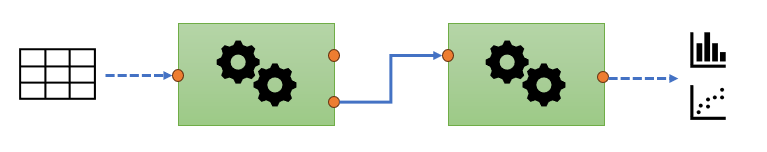

:::::::::::::::::::::::::::::::::::::: questions 

- What does the `struct` package do?
- What does the `structToolbox` package do?

::::::::::::::::::::::::::::::::::::::::::::::::

::::::::::::::::::::::::::::::::::::: objectives

- Describe the philosophy underpinning `struct` templates

::::::::::::::::::::::::::::::::::::::::::::::::

### What is a data processing workflow?
There many slightly different definitions of a workflow, so its useful to be specific about what we mean by a workflow in this course. Here, a workflow is a sequence of steps, or modules, where each step implements a different data processing step. For example, one step in the workflow might be to normalise the data, another to scale it. The workflow steps can be connected in any order, and the data flows into one step, is processed, and then the output is used an input to the next step.

:::::::::::::: challenge
## Your workflow
- What data processing steps do you think you might need for your workflow?
- What statistical analysis might you like to include as part of your workflow?

:::::::::::::: solution
## Suggestions
- Quality filtering, normalisation, scaling, transformation, imputation
- univariate significance tests, multivariate visualisation
::::::::::::::

::::::::::::::

### The `struct` package
As you will already have seen, there is a large number of R packages. This is one of the great strengths of R. However, when writing code to carry out a number of workflow steps it can be difficult to integrate all of the required packages to together in a way that is transparent and reproducible. 

The `struct` package tries to address this by defining a number of "templates". These templates define what the data structure should be, how data will flow through an object, and which output is transferred to the input of the next object. 

{alt="A graphical representation of two workflow steps. Data flow into the first step from the left, is processed and then flows out of one of two outputs from the first step and into the first input of the second step. The data is processed again by the second step and the first output then connects to two different type of chart."}

As well as the templates `struct` also provides a number of "methods" for each template. Methods are functions change how they work depending on the input template. Some methods defined by `struct` enable easy access to inputs and outputs of the templates, while others, such as `show` define what is displayed when the template is displayed on the console.

None of the templates in `struct` implement any data processing steps, they only define what a step should look like. The idea is that other packages can implement their code inside a template to make it compatible with other workflow steps. For example, the `structToolbox` package uses the `struct` templates to convert processing steps from other packages into workflow steps using `struct' templates. All workflow steps are then compatible with each other, and you no longer need to worry about _how_ to implement the steps, you can focus on _what_ steps to use and in what order.

### `struct` Templates
There are a number of `struct` templates working in the background, but there are 5 key front facing templates that you will use a lot. When we talk about as instance of a template, we refer to it as an "object".

#### DatasetExperiment object
This template defines the what format the data should be in. You will often find that the data you use actually consists of three key elements:

::::: context
**A table of peak areas (or similar)** 
The template defines that the features (metabolites) should be in the columns, and the samples in the rows.

**Meta data for the samples** 
Meta data is data provided _in addition_ to the sample names. It can come in many forms. For example it could be categorical: e.g. whether the sample was a control sample or a treated sample, or it could be continuous: e.g. the BMI of the subject. The templates defines that the samples are in rows, and each column corresponds to one piece of meta data.

**Meta data for the features** 
Like the sample meta data, additional information about each feature is stored here, such as m/z and retention time, or an annotation. The template defines that the features are in rows and the columns correspond to the meta data.
:::::

